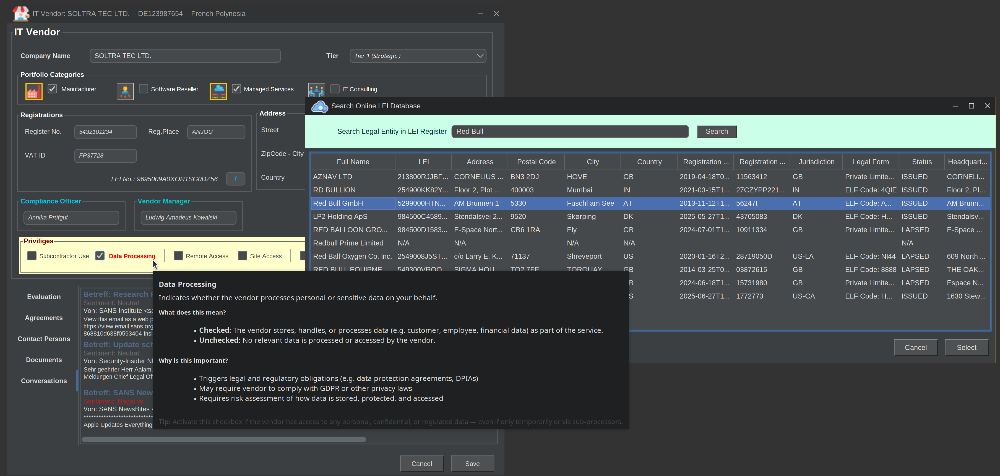
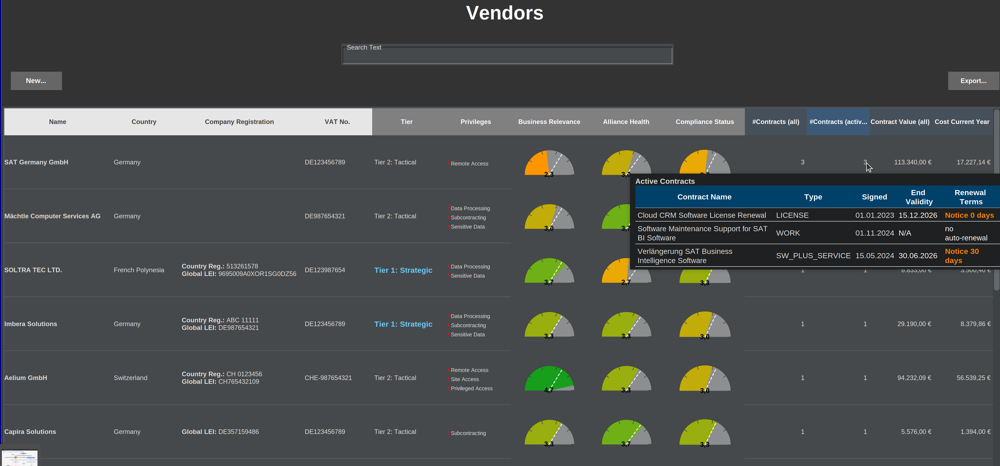
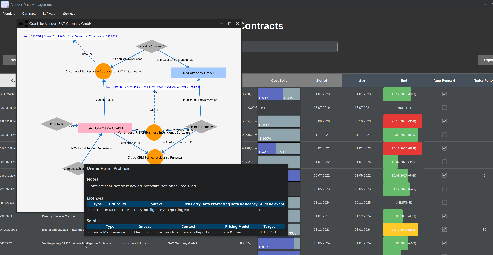

# IT Vendor and Contract Management Software

This software provides a comprehensive solution for managing IT vendors, contracts, and licenses. It helps organizations track their vendor relationships, evaluate compliance, and manage software licenses effectively.

## Features

### 1. **Vendor Management**
   The Vendor Management module provides a centralized overview of all relevant information related to your IT vendors – including tier classification, access privileges, contracts, contact persons, and associated documentation. Support regulatory compliance checks with valuable context data. 
     


   
### 2. **Contract Management**
   The Contract Management module allows for structured tracking and monitoring of contracts. It captures key details such as contract numbers, validity periods, associated licenses, and services. Financial information – including contract value, renewal terms, and other critical conditions – is clearly documented and easily accessible.



### 3. **License Management**
   This module supports comprehensive management of software licenses, based on key metrics such as criticality, data handling, and associated costs. It also includes tools for monitoring license validity and managing renewals to ensure ongoing compliance and cost efficiency.- Monitor license validity and renewals.
   
### 5. **Graphical Visualization and Reporting**
   - Graph-based visualizations illustrating relationships between vendors, contracts, licenses, and key parameters.
   
### 6. **Strategic View**
   - Support decision making and planning by providing relevant one-spot information.
   - Exportable reports in JSON, spreadsheet format, HTML and PDF.

# System Requirements

## Minimum Requirements

- **Operating System:** Windows 10+, macOS 11+, Linux (Ubuntu/Fedora or similar)
- **Java:** JVM compatible with Java 17 (e.g., Azul Zulu, OpenJDK, Oracle JDK, Amazon Corretto)
- **RAM:** Minimum 4 GB
- **Storage:** Approximately 300 MB + database files
- **Display Resolution:** 1280×800 or higher
- **Supported Databases:** PostgreSQL, MariaDB, MySQL, Derby (Embedded & Client)

## Recommended Configuration

- Java 17 or newer (64-bit)
- 8 GB RAM or more
- Internet connection (for remote database access and public LEI cloud database queries)

## Supported Databases

The following database systems and drivers should be compatible out of the box:

| Database                     | Status                  | Notes                                        |
|------------------------------|-------------------------|----------------------------------------------|
| Apache Derby - Embedded Mode  | 🧪Fallback/Test  | If no valid database configuration is found, the software will use an embedded Derby database as a fallback for file persistence (typically for testing). |
| Apache Derby - Client Mode    | 🧪Developer        |                                              |
| PostgreSQL                    | ✅Compatible       |                                              |
| MySQL                         | ✅Compatible       |                                              |
| MariaDB                       | ✅Compatible       |                                              |

## Open-Source Software and Third-Party Licenses
This application utilizes several open-source libraries that are available under different open-source licenses, including the Apache License 2.0, MIT License, and others. The libraries used and their respective licenses are listed below:

- **Apache Log4j 2.0 – Apache License 2.0**
- **Hibernate Validator – Apache License 2.0**
- **GraphStream – MIT License**
- **FlatLaf – MIT License**
- **JFreeChart – GNU LGPL v3.0 License**
- **Thymeleaf – Apache License 2.0**
- **Apache POI – Apache License 2.0**
- **Jakarta Mail – Eclipse Foundation License**

## Configuration

This application uses a database for data storage.  
The database configuration is located in the `config.properties` file, which should be stored alongside the executable JAR.

Example configuration for PostgreSQL:

```properties
# PostgreSQL Database Configuration  
db.type=postgresql  
db.driver=org.postgresql.Driver  
db.url=jdbc:postgresql://localhost:5432/mydatabase  
db.user=postgres  
db.password=secret  
db.schema=update

