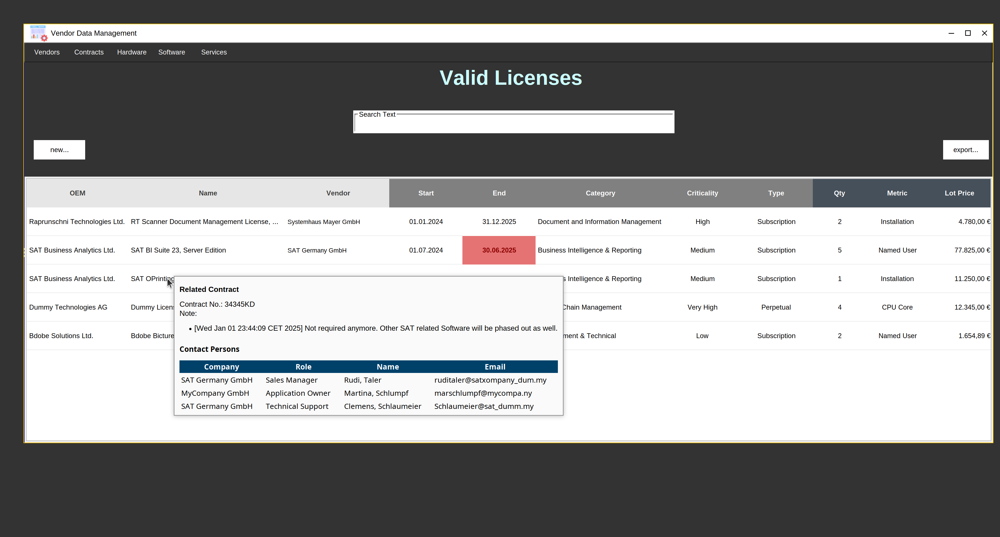
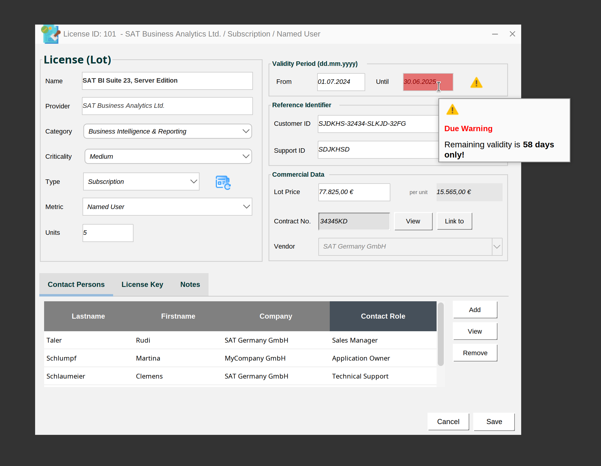
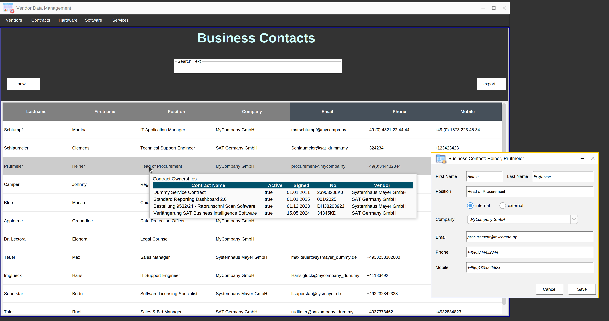
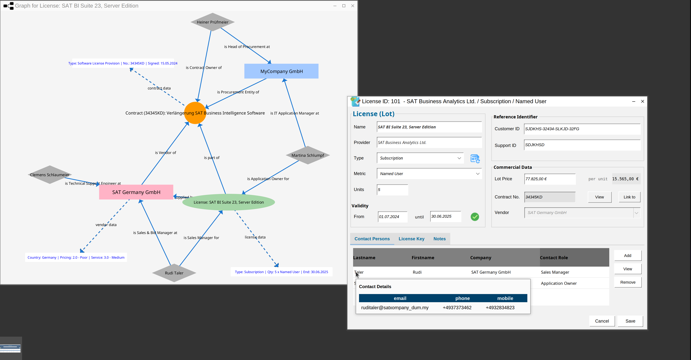
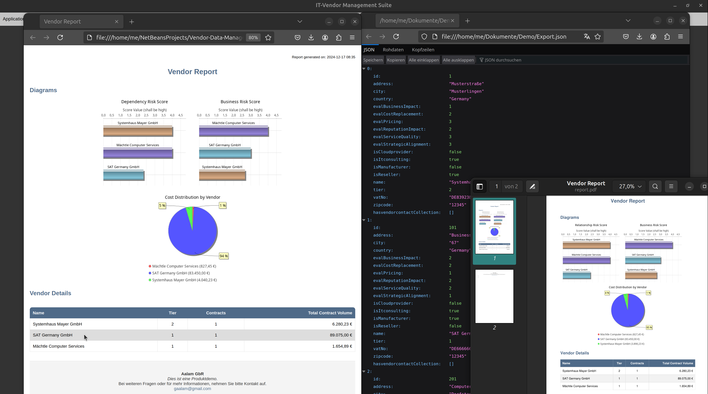
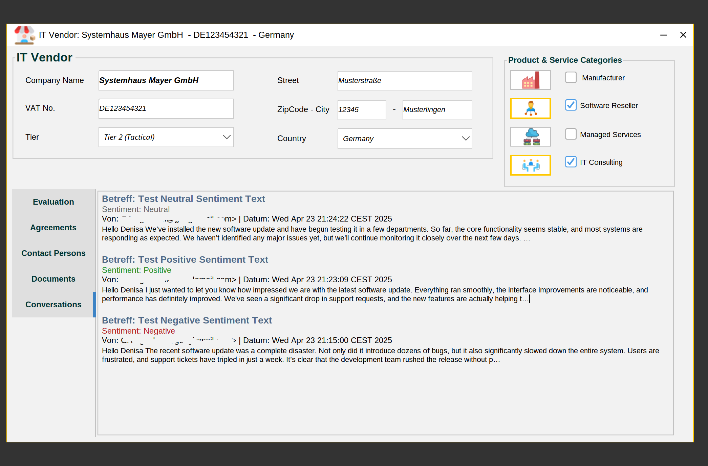
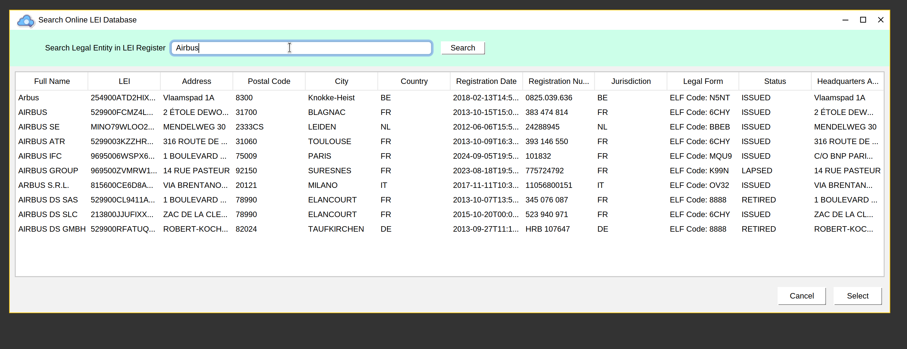
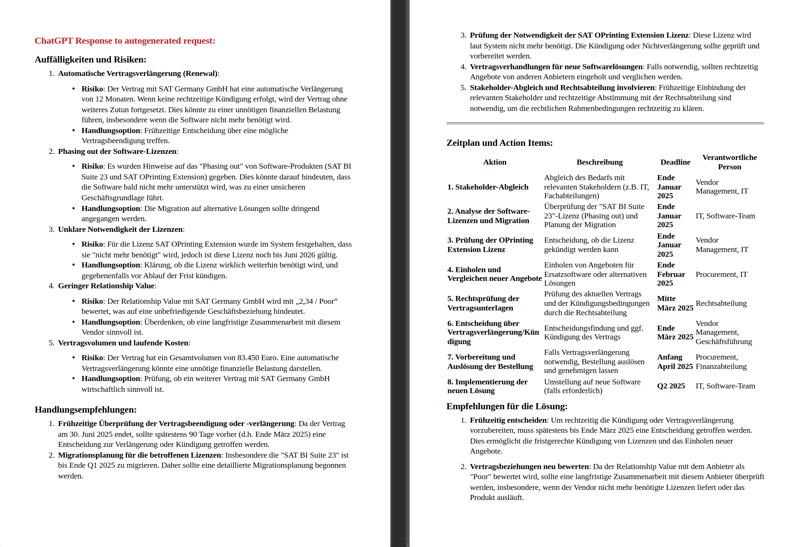

# 👋 Welcome to my GitHub profile! 

Hello! I'm Giw and I have a passion for analysing requirements and solution development. I possess several years of professional exoerience in Bid and Vendor Management roles. My technical stack includes  Business Data Analytics, Java and SQL as well.

---

## 🚀 About Me

- **👀 Interests:** Here, I focus on software develoment with **Java** 
- **🌱 Currently Learning:** I’m exploring new frameworks and tools that improve the development workflow.
- **💞️ Collaboration:** I’m always open to collaborating on **Java-centric** projects or any project that involves structured data management using **SQL**, **XML**. 
                        If you're working on something interesting in these areas, feel free to reach out!
- **⚡ Fun fact:** When I’m not coding, I’m usually digging into the latest advancements in IT Vendor Management, IT Bid Management
---

## 🌍 Let's Connect
- **💬 Let’s chat:** I’m always up for a discussion about **Java**, **SQL**, **XML**, **XSLT**, or anything tech-related. Feel free to reach out!
---

## 🔧 My Tech Stack

Here’s a quick look at the technologies I work with and love:

- **Languages:** Java, SQL, XML, HTML
- **Frameworks:** JPA (Jakarta, EclipseLink), Swing, GraphStream, Apache POI, Thymeleaf, flying-saucer-pdf 
- **Databases:** Apache Derby, Oracle SQL, and other relational databases
- **Tools:** Maven, Git, Netbeans, Eclipse, Javadoc, PMD

---

## 🎯 Current Projects

Current Projects

IT Vendor Management Suite

Motivation

The idea behind this project is based on my own experiences as a software developer, vendor manager, digitalization officer, and business data analyst. My motivation for this project comes from combining these diverse perspectives to develop a solution specifically tailored to the needs of SMEs, improving processes and data visibility in vendor management.

With my Vendor Management Suite, companies can manage their IT contracts, software licenses, and vendor relationships more efficiently. The solution provides a user-friendly interface for tracking contract durations, costs, and IT services—perfect for businesses looking to optimize their resources. No more time-consuming searches for contracts, terms, costs, key knowledge holders, or Excel spreadsheets!

Maintaining data ("documentation") requires some effort. However, the clear goal is to minimize this effort to a reasonable level while maximizing the value extracted from the data.

Features

The application is based on an easy-to-use (Java Swing-based) interface and a relational database (currently a local Apache Derby DB server in my setup). It allows users to manage vendors, contracts, licenses, and IT services with just a few clicks. With integrated relationship, duration, and cost management, companies can not only access data faster but also make more informed decisions.

🔹 Vendor and Contract Management:
All relevant data on vendors, IT contracts, and software licenses is centralized in one place. Users can access it at any time and keep track of key metrics.

🔹 Contract and License Management:
The solution helps monitor contract durations and costs, ensuring that no important deadlines are missed.

🔹 Flexible Reporting:
Data can be easily exported to HTML, PDF, or XLSX. This enables quick report generation and sharing for analysis or collaboration.

🔹 AI-Powered Risk Analysis:
The AI detects potential risks in vendor relationships and contracts, providing recommendations to proactively address issues.

Screenshots 
- 
- 
- 
- 
- 
- 
- 
- 
