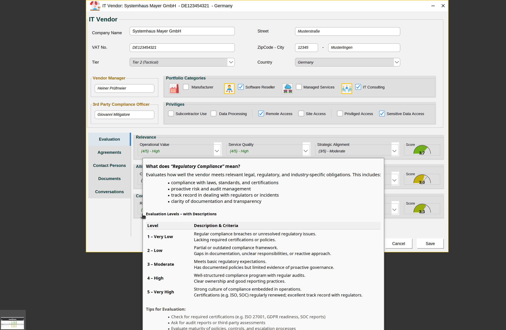
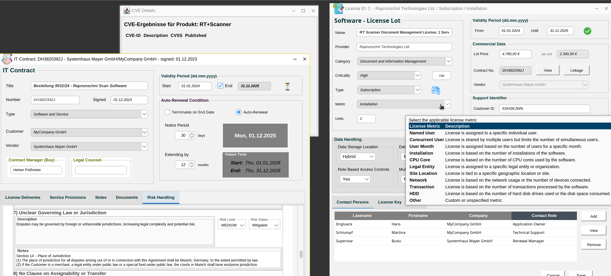
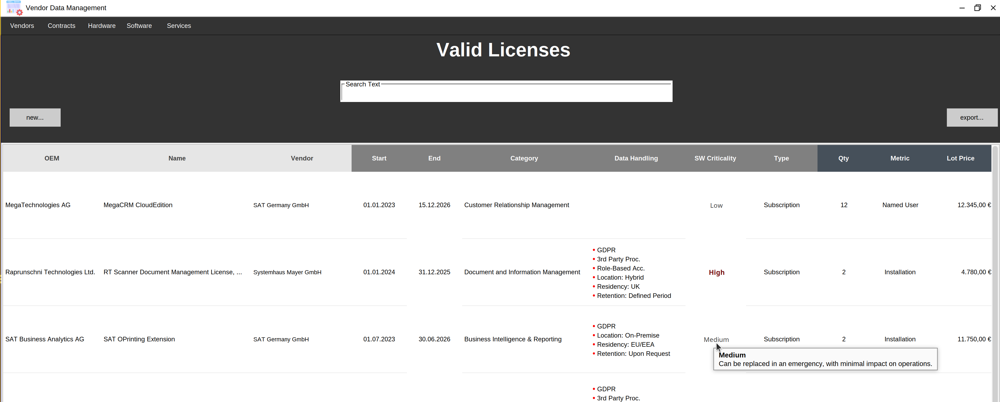
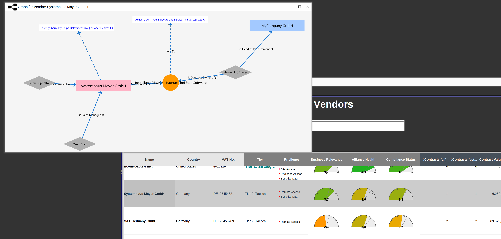
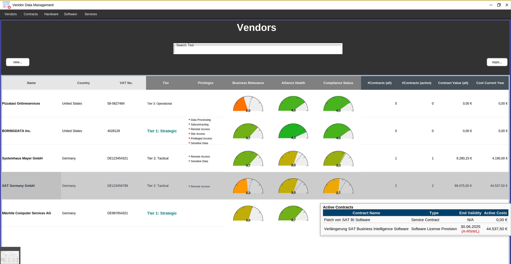

# IT Vendor and Contract Management Software

This software provides a comprehensive solution for managing IT vendors, contracts, and licenses. It helps organizations track their vendor relationships, evaluate compliance, and manage software licenses effectively.

## Features

### 1. **Vendor Management**
   - Manage data about your IT vendors incl. tier, privileges, contracts, contact persons, documents in one place.
   - Note vendors’ **regulatory compliance** against legal, industry, and corporate standards in a high-level structured form. No details.
   - Structured evaluation scheme comprising 9 categories, with ratings (**1 - 5**).
      

   
### 2. **Contract Management**
   - Track contracts, including **contract numbers**, **validity periods**, licenses and services provided 
   - Includes financial data like **contract price**, **renewal conditions** and more



### 3. **License Management**
   - Manage software licenses by metrics, criticality, data handling and costs.
   - Monitor license validity and renewals.


   
### 5. **Graphical Visualization and Reporting**
   - Graph based visualizations of relations between vendor, contracts, licenses and other basic parameters.
   


   
### 6. **Strategic View**
   - Support decision making nd planning by providing one-spot information about **Operational Value**, **Service Quality**, and **Strategic Alignment**.
   - Exportable reports in JSON, spreadsheet format, HTML and PDF.
 


# System Requirements

## Minimum Requirements

- **Operating System:** Windows 10+, macOS 11+, Linux (Ubuntu/Fedora or similar)
- **Java:** JVM compatible with Java 17 (e.g., Azul Zulu, OpenJDK, Oracle JDK, Amazon Corretto)
- **RAM:** Minimum 4 GB
- **Storage:** Approximately 300 MB + database files
- **Display Resolution:** 1280×800 or higher
- **Supported Databases:** PostgreSQL, MariaDB, MySQL, Derby (Embedded & Client)

## Recommended Configuration

- Java 17 or newer (64-bit)
- 8 GB RAM or more
- Internet connection (for remote database access and public LEI cloud database queries)

## Supported Databases

The following database systems and drivers should be compatible out of the box:

| Database                     | Status                  | Notes                                        |
|------------------------------|-------------------------|----------------------------------------------|
| Apache Derby - Embedded Mode  | 🧪Fallback/Test  | If no valid database configuration is found, the software will use an embedded Derby database as a fallback for file persistence (typically for testing). |
| Apache Derby - Client Mode    | 🧪Developer        |                                              |
| PostgreSQL                    | ✅Compatible       |                                              |
| MySQL                         | ✅Compatible       |                                              |
| MariaDB                       | ✅Compatible       |                                              |

## Open-Source Software and Third-Party Licenses
This application utilizes several open-source libraries that are available under different open-source licenses, including the Apache License 2.0, MIT License, and others. The libraries used and their respective licenses are listed below:

- **Apache Log4j 2.0 – Apache License 2.0**
- **Hibernate Validator – Apache License 2.0**
- **GraphStream – MIT License**
- **FlatLaf – MIT License**
- **JFreeChart – GNU LGPL v3.0 License**
- **Thymeleaf – Apache License 2.0**
- **Apache POI – Apache License 2.0**
- **Jakarta Mail – Eclipse Foundation License**

## Configuration

This application uses a database for data storage.  
The database configuration is located in the `config.properties` file, which should be stored alongside the executable JAR.

Example configuration for PostgreSQL:

```properties
# PostgreSQL Database Configuration  
db.type=postgresql  
db.driver=org.postgresql.Driver  
db.url=jdbc:postgresql://localhost:5432/mydatabase  
db.user=postgres  
db.password=secret  
db.schema=update

