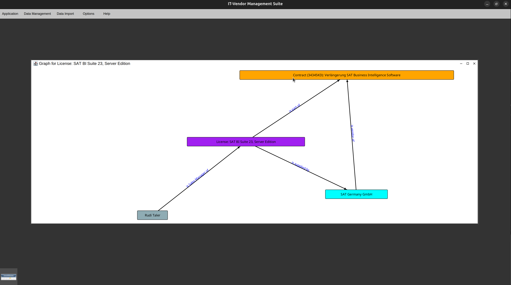
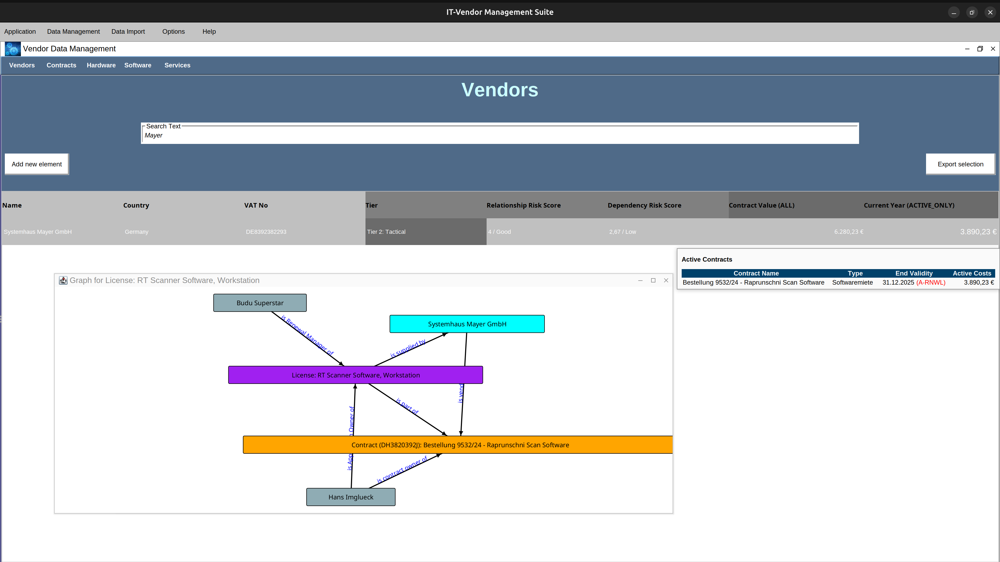
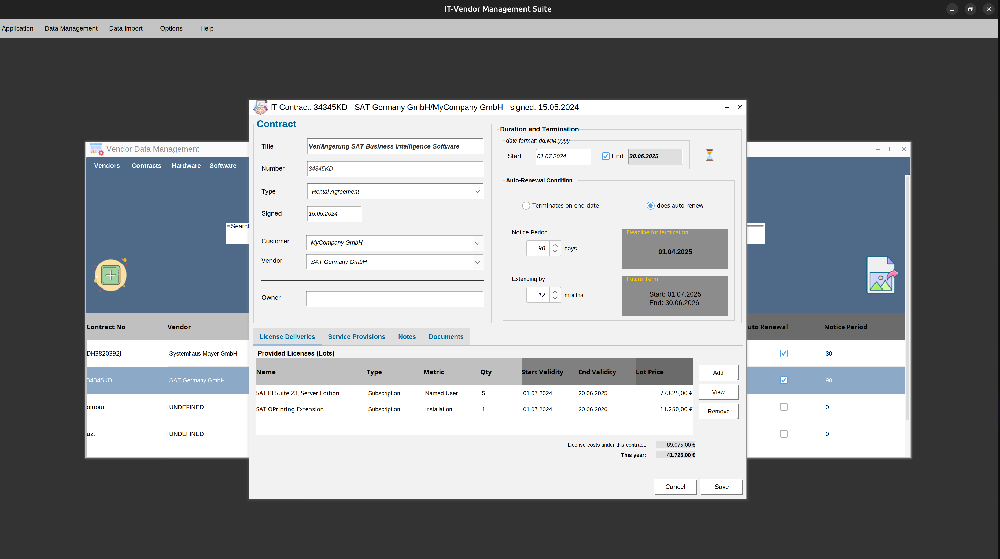
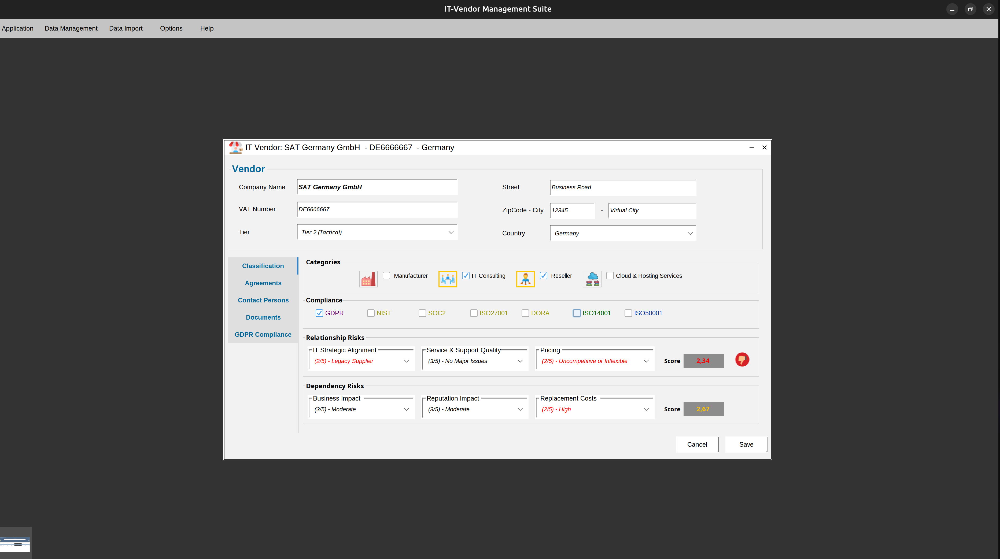
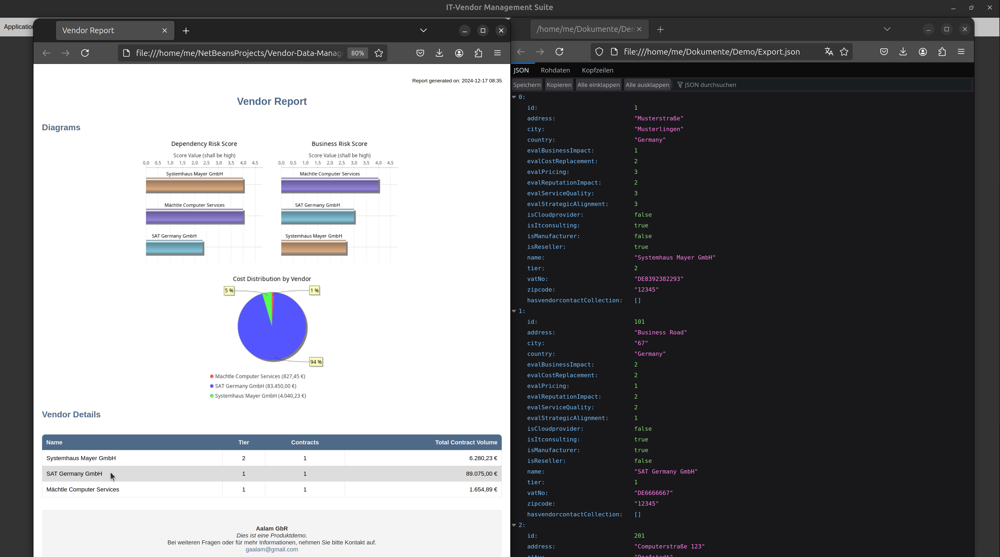

# 👋 Welcome to my GitHub profile! 

Hello! I'm **@Gaalam**, a software developer with a deep passion for **Java**, **SQL**, **XML**, and **XSLT**. 
I specialize in creating robust, scalable applications and working with structured data. Here's a little more about me:

---

## 🚀 About Me

- **👀 Interests:** I am passionate about building enterprise-level applications, especially with **Java** and **SQL**. 
- **🌱 Currently Learning:** I’m exploring new frameworks and tools that improve the development workflow.
- **💞️ Collaboration:** I’m always open to collaborating on **Java-centric** projects or any project that involves structured data management using **SQL**, **XML**. 
                        If you're working on something interesting in these areas, feel free to reach out!
- **⚡ Fun fact:** When I’m not coding, I’m usually digging into the latest advancements in IT Vendor Management, IT Bid Management
---

## 🌍 Let's Connect
- **💬 Let’s chat:** I’m always up for a discussion about **Java**, **SQL**, **XML**, **XSLT**, or anything tech-related. Feel free to reach out!
---

## 🔧 My Tech Stack

Here’s a quick look at the technologies I work with and love:

- **Languages:** Java, SQL, XML, HTML
- **Frameworks:** JPA (Jakarta, EclipseLink), Swing, GraphStream, Apache POI, Thymeleaf, flying-saucer-pdf 
- **Databases:** Apache Derby, Oracle SQL, and other relational databases
- **Tools:** Maven, Git, Netbeans, Eclipse, Javadoc, PMD

---

## 🎯 Current Projects
GERMAN

IT Vendor Management Suite

Motivation
-

Die Idee hinter diesem Projekt basiert auf meinen eigenen Erfahrungen als Software Entwickler, Vendor Manager, Digitalisierungsbeauftragter und Business Data Analyst. 
Mich treibt in diesem Projekt an, mit diesen vielfältigen Perspektiven an einer Lösung zu arbeiten, die speziell auf die Bedürfnisse von KMU zugeschnitten ist, um Prozesse und die Sicht auf die Daten im Bereich Vendor Management zu verbessern.

Mit meiner Vendor Management Suite können Unternehmen ihre IT-Verträge, Softwarelizenzen und Vendorenbeziehungen effizienter verwalten. 
Die Lösung bietet eine benutzerfreundliche Oberfläche zur Verwaltung von Vertragslaufzeiten, Kosten und IT-Services – perfekt für Unternehmen, die ihre Ressourcen optimal nutzen möchten. 
Kein langwieriges Suchen nach Verträgen, Laufzeiten, Kosten, Wissensträgern oder Excel-Listen mehr!
 
Datenpflege ("Dokumentation") erfordert einen gewissen Aufwand. Aber die klare Intention ist, diesen Aufwand auf ein hinreichendes Minimum zu reduzieren und gleichzeitig ein Optimum aus den Daten herauszuholen.

Funktionen
-
Die Anwendung basiert auf einer einfach zu bedienenden (Java Swing basierten) Oberfläche und einer relationalen Datenbank (bei mir derzeit ein lokaler Apache Derby DB Server), die es ermöglicht, Vendoren, Verträge, Lizenzen und IT-Services mit wenigen Klicks zu pflegen. Durch eine integrierte Verwaltung von Beziehungen, Laufzeiten und Kosten können Unternehmen nicht nur schneller auf Daten zugreifen, sondern auch fundiertere Entscheidungen treffen. 

  🔹 Verwaltung von Vendoren und Verträgen: 
    Alle relevanten Daten zu Vendoren, IT-Verträgen und Softwarelizenzen werden an einem Ort gesammelt. Anwender können jederzeit darauf zugreifen und haben die wichtigsten Kennzahlen im Blick.

  🔹 Vertrags- und Lizenzmanagement: 
    Die Lösung hilft, Vertragslaufzeiten und Kosten zu überwachen und sorgt dafür, dass keine wichtigen Fristen übersehen werden.

  🔹 Flexibles Reporting: 
    Daten können einfach in HTML, PDF oder XLSX exportiert werden. So lassen sich Berichte schnell erstellen und weitergeben, um sie zu analysieren oder mit anderen zu teilen.

  🔹 KI-gestützte Risikoanalyse: 
    Die KI erkennt potenzielle Risiken in Vendorenbeziehungen und Verträgen und gibt Handlungsempfehlungen, um Probleme frühzeitig anzugehen.

News und Ausblick
-
Ich arbeite gerade an den Reporting-Funktionen die es ermöglichen sollen, selektierte Datensätze in verschiedenen Formaten (HTML, PDF, XLSX) u.a. in Templates zu exportieren. 
Derzeit experimentiere ich auch mit den Integrationsmöglichkeiten von KI für Handlungsempfehlungen auf Grundlage der übermittelten Daten. Es ist schon ganz interessant, was die KI da zurückliefert. 

Screenshots 
- 
- 
- 
- 
- 
- 
- 
