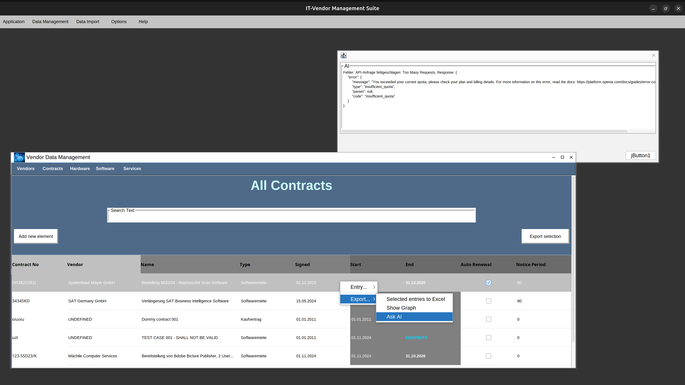
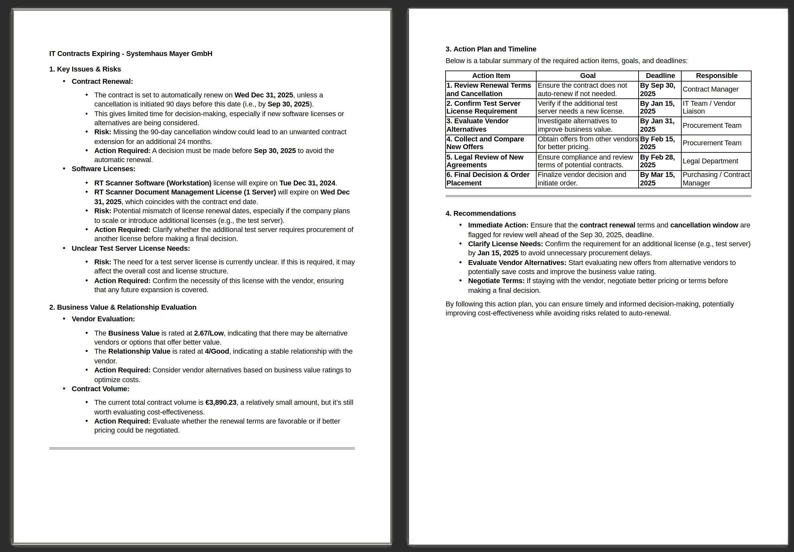

# 👋 Welcome to my GitHub profile! 

Hello! I'm **@Gaalam**, a software developer with a deep passion for **Java**, **SQL**, **XML**, and **XSLT**. 
I specialize in creating robust, scalable applications and working with structured data. Here's a little more about me:

---

## 🚀 About Me

- **👀 Interests:** I am passionate about building enterprise-level applications, especially with **Java** and **SQL**. 
- **🌱 Currently Learning:** I’m exploring new frameworks and tools that improve the development workflow.
- **💞️ Collaboration:** I’m always open to collaborating on **Java-centric** projects or any project that involves structured data management using **SQL**, **XML**. 
                        If you're working on something interesting in these areas, feel free to reach out!
- **⚡ Fun fact:** When I’m not coding, I’m usually digging into the latest advancements in IT Vendor Management, IT Bid Management
---

## 🌍 Let's Connect
- **💬 Let’s chat:** I’m always up for a discussion about **Java**, **SQL**, **XML**, **XSLT**, or anything tech-related. Feel free to reach out!
---

## 🔧 My Tech Stack

Here’s a quick look at the technologies I work with and love:

- **Languages:** Java, SQL, XML, XSLT
- **Frameworks:** Jakarta, EclipseLink, GraphStream 
- **Databases:** Apache Derby, Oracle SQL, and other relational databases
- **Tools:** Maven, Git, Netbeans

---

## 🎯 Current Projects
GERMAN:

Mit meiner Vendor Management Suite können Unternehmen ihre IT-Verträge, Softwarelizenzen und Vendorenbeziehungen effizienter verwalten. Die Lösung bietet eine benutzerfreundliche Oberfläche zur Verwaltung von Vertragslaufzeiten, Kosten und IT-Services – perfekt für Unternehmen, die ihre Ressourcen optimal nutzen möchten. Kein langwieriges Suchen nach Verträgen oder Excel-Listen mehr!

Die Anwendung basiert auf einer einfach zu bedienenden Swing-Oberfläche und einer relationalen Datenbank, die es ermöglicht, Vendoren, Verträge, Lizenzen und IT-Services mit wenigen Klicks zu pflegen. Durch die integrierte Verwaltung von Beziehungen, Laufzeiten und Kosten können Unternehmen nicht nur schneller auf Daten zugreifen, sondern auch fundiertere Entscheidungen treffen.

Die neue Reporting-Funktion der IT Vendor Management Suite ermöglicht es Nutzern, ihre Daten einfach in verschiedenen Formaten (HTML, PDF, XLSX) zu exportieren. Die Kombination aus datenbasierten Reports und KI-gestützten Handlungsempfehlungen kann Unternehmen dabei helfen, schneller und fundierter Entscheidungen zu treffen, ihre Vendorenbeziehungen zu optimieren und Risiken frühzeitig zu erkennen. Unternehmen können hierdurch leichter proaktiv agieren.

- 
- 
- 
- 
- 
